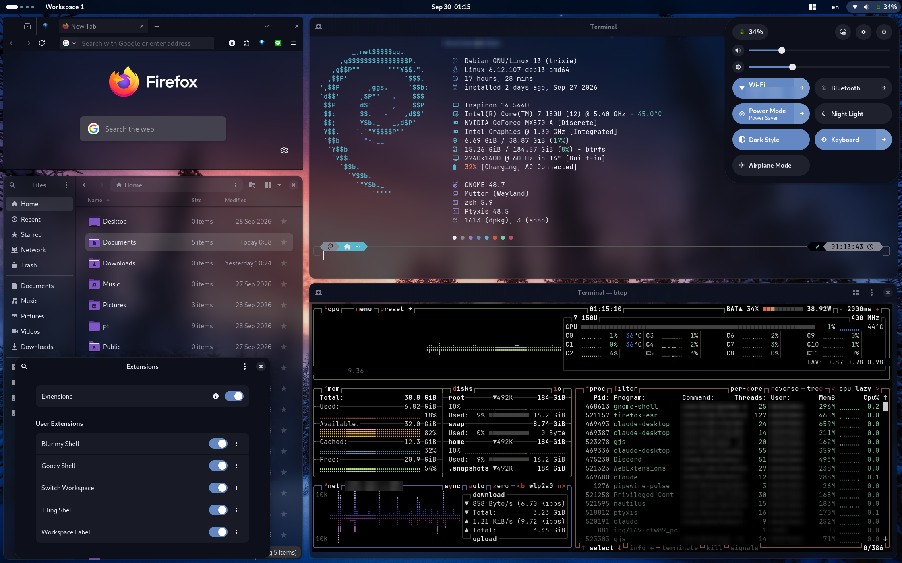
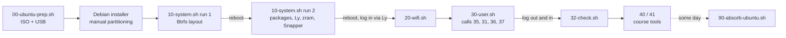

# my-debian-desktop-setup



A fresh **Debian 13 "trixie"** netinst turned into a lean, encrypted, tiling **GNOME 48** desktop
with a frosted-glass look called **Gooey**. Every setting you see is applied by a script in this repo,
so the whole laptop can be rebuilt from the official Debian ISO in an evening.

> Built for one specific laptop (Dell Inspiron 14 5440, dual-booting Ubuntu). The scripts are
> honest about that: disk names, Wi-Fi and course tools are mine. Read before you run.

<!-- Screenshots: put PNGs in screenshots/ with these names, then delete the comment markers.


-->

---

## At a glance

| | |
|---|---|
| **Base** | Debian 13.7 netinst, no desktop task, APT with no recommends (~9.6 GiB installed, ~6–7 GiB on disk) |
| **Desktop** | GNOME 48 from individual packages: no `gnome-core`, no GDM |
| **Login** | [Ly](https://codeberg.org/fairyglade/ly) 1.4.1 TUI login manager, built from source with Zig 0.16 (not packaged in Debian) |
| **Tiling** | Tiling Shell with custom layouts, 4 fixed workspaces on `Super+1…4` |
| **Look** | "Gooey" everywhere: one navy palette + live blur, from the terminal to the top bar, dock, menus, GNOME apps, Firefox, ONLYOFFICE and Neovim |
| **Terminal** | Ptyxis + zsh + Powerlevel10k + JetBrainsMono Nerd Font, fastfetch on every new tab, cava audio bars |
| **Editor** | Latest Neovim + LazyVim; Python, TS/React, Tailwind; Jupyter notebooks inside Neovim |
| **Disk** | LUKS2 full-disk encryption → Btrfs (zstd), 6 subvolumes, Snapper snapshots on every `apt` run, zram swap |
| **Services** | Tailscale, SeaDrive (mounted at boot), Docker and PhotoPrism installed but off until you ask |

---

## Features

### The Gooey look: one palette, frosted glass everywhere

Ptyxis ships a palette called **Gooey**. Every other part of the desktop is recoloured to match it,
and the terminal's see-through, blurred background carries over to the shell and apps.

| Role | Colour |
|---|---|
| Background (navy) | `#0D101B` |
| Raised surfaces | `#1F222D` |
| Accent (blue) | `#6488C4` |
| Bright blue | `#97BBF7` |
| Text (off-white) | `#EBEEF9` |

- **Terminal:** Ptyxis at 70% opacity with a live blur behind it ([Blur my Shell](https://github.com/aunetx/blur-my-shell), strength 22, focus doesn't un-blur it).
- **Top bar:** wallpaper-only blur at 30% brightness. It looks the same as live blur and costs nothing.
- **Dock, quick settings, calendar, right-click menus, notifications, dialogs, volume pop-ups, Alt+Tab:**
  all recoloured by **Gooey Shell**, a small stylesheet-only extension that lives in this repo
  ([`dotfiles/gnome-shell/extensions/gooey-dock@kkattmos`](dotfiles/gnome-shell/extensions/gooey-dock@kkattmos/stylesheet.css)).
  The calendar grid has transparent day pills, and today is marked in Gooey blue.
- **Every libadwaita app** (Settings, Extensions, System Monitor, Loupe, Papers, …): Gooey navy
  through one [`gtk.css`](dotfiles/gtk-4.0/gtk.css). **Files** keeps the terminal's 70% navy + blur.
- **Firefox ESR:** solid navy tab strip and toolbar, 70% navy blurred page area, see-through New Tab page
  ([`userChrome.css`](dotfiles/firefox/chrome/userChrome.css)).
- **ONLYOFFICE:** a full Gooey interface theme (210+ colours) that also switches its UI font to Cantarell.
- **Neovim:** tokyonight rebuilt from the terminal's 16 colours, with a transparent background so the blur shows through.
- **Papirus-Dark** icons, Cantarell 12, 24-hour clock, battery percentage, and a 16:10 wallpaper from Wallhaven.

**Battery cost, measured on this laptop.** Blurring every app plus the top bar cost about **+4 W**,
roughly 1.5 hours of battery. The shipped set blurs only the terminal, Files and Firefox, and puts the top bar on
wallpaper-only blur:

| | Blur on vs off |
|---|---|
| Idle desktop | **+0.03 W** (no measurable difference) |
| Terminal scrolling continuously | +1.2 W |
| Firefox visible (still page) | +1.4 W |
| Firefox visible, cursor blinking or page moving | +2.0 W |

To save that last hour, remove `firefox-esr` from Blur my Shell → Applications.

### Desktop and tiling

- **Minimal GNOME 48:** only the pieces that are used (shell, Settings, Files, Ptyxis, Loupe, Papers,
  File Roller, System Monitor, Disks, Tweaks, Extension Manager). PipeWire audio, power profiles, Bluetooth.
- **Ly** on tty2 instead of GDM. It's built Wayland-only, and its PAM file is fixed so the desktop gets a
  proper user session (`class=user`).
- **[Tiling Shell](https://github.com/domferr/tilingshell):** five saved layouts, one per workspace. Hold
  `Ctrl` while dragging to snap a window into a tile; `Super+←/→` moves windows between tiles.
- **4 fixed workspaces:** `Super+1…4` to switch, `Super+Shift+1…4` to move a window.
  **[Switch Workspace](https://github.com/sunwxg/gnome-shell-extension-switchworkspace)** adds an
  Alt+Tab-style switcher on ``Ctrl+` `` (the key above Tab).
- **Workspace Label:** another extension of mine. It shows the current workspace's name next to
  Activities; click it to jump to a workspace or rename it.
- **Screen recording** built in: `Ctrl+Shift+Alt+R`.

### Terminal and shell

- **Ptyxis 48.5** replaces GNOME Console: Gooey palette, JetBrainsMono Nerd Font 12, 110×32, no bell.
  It's also the terminal that apps open (`xdg-terminals.list`).
- **fastfetch** prints a system summary at the top of each new tab (not in nested shells).
  **cava** draws audio bars in matching colours.
- **zsh**, no oh-my-zsh, one readable [`~/.zshrc`](dotfiles/zshrc):
  - Powerlevel10k prompt (`p10k configure` wizard)
  - autosuggestions, syntax highlighting, `fzf` (`Ctrl+R`, `Ctrl+T`, `Alt+C`), `zoxide` (`z proj`)
  - `eza` with icons for `ls`/`ll`/`la`/`tree`, `bat` for `cat`, `lazygit` as `lg`, `nvim` as `v`
  - oh-my-zsh's git aliases (`gst`, `ga`, `gcmsg`, `gp`, `glog`, …), `update` (apt with a snapshot), `snaps`
  - `svc docker|photoprism|seadrive on|off|status` switches services on demand
  - fixes Ly's `TERM=linux` leak, so graphical terminals get 256 colours and Unicode

### Neovim

- **Latest upstream Neovim** (Debian's 0.10 is too old for LazyVim), checksum-verified, in `~/.local`.
- **LazyVim** with the Python, TypeScript/React, Tailwind, JSON, Markdown, Docker, Prettier and ESLint extras.
  Mason installs pyright, ruff, vtsls, eslint, prettier, tailwind, json and emmet.
- **Jupyter notebooks in Neovim, laid out like Colab:** opening `x.ipynb` shows rendered Markdown text cells
  (headings, `$math$`) and each code cell as a shaded box
  ([jupytext.nvim](https://github.com/GCBallesteros/jupytext.nvim) in Markdown mode +
  [render-markdown.nvim](https://github.com/MeanderingProgrammer/render-markdown.nvim)), with pyright inside the cells
  ([otter.nvim](https://github.com/jmbuhr/otter.nvim)). [molten-nvim](https://github.com/benlubas/molten-nvim)
  connects a kernel on open, shows saved outputs under their cells and runs cells: `Alt+Enter` run and go to the
  next cell, `\rc` run cell, `\ra` run all, `]c`/`[c` move between cells, `\cb` new cell. Outputs are saved back
  into the `.ipynb`. `nb x.ipynb` (or double-clicking a notebook in Files) opens it in **kitty**, which draws plots
  under the cell ([image.nvim](https://github.com/3rd/image.nvim)); Ptyxis can't draw images, so there plots open
  in the image viewer. The kernel venv has numpy, scipy, matplotlib, pandas and sympy.
- **Gooey colour scheme** with a transparent background, and `:terminal` uses the same ANSI colours as Ptyxis.
- A printable two-page cheat sheet: [`neovim-cheatsheet.pdf`](neovim-cheatsheet.pdf).

### Filesystem and boot

```
nvme0n1   p1  1 GB    EFI (shared with Ubuntu)
          p2  466 GB  Ubuntu (kept for now)
          p3  185 GB  LUKS2 → Btrfs  (Debian)
          p7  1 GB    ext4 /boot  (deliberately at the end, so p2 + p3 can merge later)
          p4, p5      other data, never touched
          p6  763 MB  Ubuntu's swap (unencrypted, never used by Debian)
```

- **LUKS2 full-disk encryption.** Secure Boot stays on (Debian's shim is signed).
- **Btrfs** with `noatime,compress=zstd:1` and subvolumes `@rootfs` `/`, `@home`, `@snapshots`, `@var_log`,
  `@var_cache` and `@docker` (no copy-on-write). The installer's files are compressed in place.
- **Snapper** snapshots `/` before and after every `apt` run, keeping 10. Home, logs, caches and Docker are
  separate subvolumes, so they never bloat snapshots. A rollback recipe is in [`guide.html`](guide.html).
- **zram swap** (half of RAM, max 8 GB, zstd) instead of a swap partition. Ubuntu's unencrypted swap is kept out
  of Debian twice: it's commented out of fstab and `systemd-gpt-auto-generator` is masked.
- **GRUB** lists Ubuntu (os-prober) and wears the [Space Isolation](https://github.com/callmenoodles/space-isolation)
  theme (optional, [`38-grub-theme.sh`](38-grub-theme.sh)), whose background also stays up behind the
  "Loading Linux …" lines. **[`90-absorb-ubuntu.sh`](90-absorb-ubuntu.sh)** later removes Ubuntu and grows
  Debian into one ~650 GB encrypted partition *while Debian keeps running*. It's resumable after a crash,
  and it verifies the initramfs before any reboot.
- **APT:** deb822 sources, `contrib` + `non-free-firmware`, never installs recommended packages.

### Apps and services

| | |
|---|---|
| Browser / office | Firefox ESR, ONLYOFFICE (official repo), VLC |
| Dev | build-essential, git, gh, Node + npm, Python venv, Docker CE + compose + buildx (off at boot), Wireshark (capture without root) |
| Sync & network | Tailscale; SeaDrive CLI as a systemd *user* service with lingering, so `~/SeaDrive` is mounted at boot before login |
| Photos | PhotoPrism, native `.deb` with SQLite, off until `svc photoprism on` → http://localhost:2342 |
| Course tools | STM32CubeIDE (Xwayland wrapper, ST-LINK udev rules, libncurses5 from Debian 12), Cisco Packet Tracer 9 |
| Tools | btop, htop, pavucontrol, xclip, ripgrep, fd, lazygit |
| Installed by hand (not scripted) | Claude desktop, Discord, Zoom, Postman (snap) |

### Thai language

- **US + Thai keyboard**, switched with `Super+Space`.
- **Sarabun** as the Thai fallback font. English text keeps Noto Sans/DejaVu, and only Thai glyphs switch.

### Hardware (Dell Inspiron 14 5440)

Intel Core 7 150U with Intel graphics (the MX570 A is unused), Realtek RTL8852BE Wi-Fi (`firmware-realtek`),
Intel SOF audio, WPA2-Enterprise university Wi-Fi + eduroam (PEAP/MSCHAPv2, TLS 1.0/1.1 re-enabled for that server) via NetworkManager.

---

## Install, from the official Debian ISO

You need: the laptop, a USB stick, a wired or WPA2-PSK Wi-Fi network for the installer, and about 1–2 hours.



### 1. Get the ISO and write the USB

On the existing Ubuntu install:

```
bash 00-ubuntu-prep.sh
```

It shows what's on the target partition and asks before continuing. It then downloads
`debian-13.7.0-amd64-netinst.iso`, checks the SHA512 sum and Debian's GPG signature, copies this kit to
`~/debian13-stash`, and writes the USB after you type `YES`. A [Ventoy](https://www.ventoy.net) stick also
works: copy the ISO and this folder onto it.

Write down your LUKS passphrase using US-keyboard characters only.

### 2. Run the Debian installer (normal graphical install)

| Question | Answer |
|---|---|
| Language / locale / keyboard | English · Thailand · `en_US.UTF-8` · American English |
| Network | Your home WPA2-PSK Wi-Fi (the installer can't join WPA-Enterprise) |
| Root password | Leave empty, so your user gets `sudo` |
| Partitioning | **Manual**, see below |
| Software selection | Untick **everything**: no desktop, no standard utilities, no SSH |
| GRUB | Installs to EFI; "force removable media path": No |

Manual partitioning:
1. Delete the old Debian-to-be partition (#3). In its free space, create a partition of *maximum minus 1 GB*
   at the **beginning**, used as **physical volume for encryption**.
2. In the 1 GB left at the end: ext4, mount point `/boot`.
3. Configure encrypted volumes → create → pick the partition → enter the passphrase.
4. Under the **Encrypted volume** heading, select the `#1` line → **btrfs**, mount point `/`, option `noatime`.
   (Not the raw `crypto` line: that gives "in use as physical volume for encrypted volume".)
5. The EFI partition stays **EFI System Partition, not formatted**. Ubuntu's swap: **do not use**.
   Ubuntu and data partitions: no mount point, not formatted. Continue past the "no swap" warning.

### 3. First boot: system setup (text console, as root, twice)

```
sudo mount -o ro /dev/nvme0n1p2 /mnt
cp -r /mnt/home/<ubuntu-user>/debian13-stash ~ && sudo umount /mnt
sudo bash ~/debian13-stash/kit/10-system.sh $USER    # run 1: compression + Btrfs subvolumes
systemctl reboot
sudo bash ~/debian13-stash/kit/10-system.sh $USER    # run 2: everything else, 10-20 min
sudo bash ~/debian13-setup/38-grub-theme.sh          # optional: Space Isolation GRUB theme
systemctl reboot
```

Run 1 checks the new `/etc/fstab` with `findmnt --verify` and stops before any unsafe reboot. Run 2
installs about 100 packages in one go, builds Ly, sets up zram, Snapper and GRUB, and moves the
installer's Wi-Fi to NetworkManager. It also copies the kit to `~/debian13-setup`.

### 4. Log in through Ly, then the user setup (GNOME terminal, no sudo)

Pick **GNOME** in Ly and log in. Open **Firefox once and close it** (this creates the profile that gets themed). Then:

```
bash ~/debian13-setup/20-wifi.sh     # university PEAP Wi-Fi + eduroam + home networks, passwords stored root-only
bash ~/debian13-setup/30-user.sh     # everything else, see below
```

`30-user.sh` refuses to run as root, asks for `sudo` itself when needed, and does the following:
zsh + Powerlevel10k, Nerd Font, Sarabun (`35`), Neovim + LazyVim + notebook venv, GNOME extensions and
settings (`31`), the Ptyxis look (`36`), the Gooey desktop look (`37`), Tailscale login, SeaDrive
(asks for the server URL and your login once, and stores only a token), and PhotoPrism.

**Log out and back in**, then check everything:

```
bash ~/debian13-setup/32-check.sh
```

On first zsh start, the Powerlevel10k wizard runs (`p10k configure` reruns it).

### 5. Course tools (optional)

Both need your own downloads (myST / NetAcad logins):

```
bash ~/debian13-setup/40-stm32cubeide.sh ~/Downloads/en.st-stm32cubeide_1.9.1_*_amd64.sh.zip
bash ~/debian13-setup/41-packettracer.sh ~/Downloads/CiscoPacketTracer_901_Ubuntu_64bit.deb
```

### 6. Finishing touches by hand

- **ONLYOFFICE theme:** Settings → Interface theme → add theme → `Ctrl+L` →
  `~/.local/share/onlyoffice/Gooey.json` → pick **Gooey**. This is needed once; `37` keeps it updated afterwards.
- **Firefox:** optional Kanagawa Wave theme from addons.mozilla.org. The Gooey CSS overrides its colours anyway.
- **STM32CubeIDE colours** are stored per workspace: Window → Preferences → General → Appearance →
  Colors and Fonts. Set "Dark background" `13,16,27`, "Dark foreground" `235,238,249`, and Text Font
  JetBrainsMono Nerd Font 12.

### 7. Later: drop Ubuntu

```
sudo bash ~/debian13-setup/90-absorb-ubuntu.sh    # asks you to type ERASE-UBUNTU
```

---

## Scripts

Run them with `bash script.sh`, never `./script.sh`: the kit often lives on an exFAT stick, which has no
execute bit. Every script is idempotent: it checks state first, keeps `.bak` copies, and is safe to rerun.

| Script | Run as | What it does |
|---|---|---|
| [`00-ubuntu-prep.sh`](00-ubuntu-prep.sh) | user, on Ubuntu | Checks the target partition, downloads + verifies the ISO, stashes the kit, writes the USB |
| [`10-system.sh`](10-system.sh) `<user>` | `sudo`, twice | Run 1: Btrfs subvolumes + compression, Ubuntu swap off. Run 2: APT, repos, packages, zram, Snapper, Ly, Docker off, PhotoPrism, NetworkManager |
| [`20-wifi.sh`](20-wifi.sh) | user | University PEAP/MSCHAPv2 Wi-Fi + eduroam (old-TLS server: TLS 1.0/1.1 allowed per profile) + home WPA2 networks (system-owned secrets, up before login) |
| [`30-user.sh`](30-user.sh) | user | zsh, fonts, Neovim/LazyVim, notebooks, calls 31/35/36/37, Tailscale, SeaDrive, PhotoPrism |
| [`31-gnome-settings.sh`](31-gnome-settings.sh) | user | Installs the 5 shell extensions; GNOME settings as dconf system defaults, read back and verified |
| [`32-check.sh`](32-check.sh) | user | Read-only status report (session, shell, extensions, look, GRUB, services, swap) |
| [`33-clean-root-leftovers.sh`](33-clean-root-leftovers.sh) | `sudo` | One-off: undoes an accidental `sudo bash 30-user.sh` |
| [`34-no-ubuntu-swap.sh`](34-no-ubuntu-swap.sh) | `sudo` | One-off: masks `systemd-gpt-auto-generator` so Ubuntu's swap stays off (10 now does this) |
| [`35-thai-font.sh`](35-thai-font.sh) | user | Sarabun + fontconfig rule, verified with `fc-match -s` |
| [`36-terminal-look.sh`](36-terminal-look.sh) | user | Ptyxis profile (Gooey, 70%), fastfetch, cava, zshrc |
| [`37-desktop-look.sh`](37-desktop-look.sh) | user | Blur my Shell + Tiling Shell settings, icons, wallpaper, GTK4 CSS, Firefox, ONLYOFFICE, Neovim colours |
| [`38-grub-theme.sh`](38-grub-theme.sh) | `sudo`, optional | Space Isolation GRUB theme (sha256-pinned release), also as the "Loading …" background; checks `grub.cfg` |
| [`40-stm32cubeide.sh`](40-stm32cubeide.sh) | user | STM32CubeIDE from ST's installer, Xwayland wrapper, udev rules |
| [`41-packettracer.sh`](41-packettracer.sh) | user | Packet Tracer 9 from the Ubuntu `.deb` |
| [`90-absorb-ubuntu.sh`](90-absorb-ubuntu.sh) | `sudo`, later | Moves Debian onto Ubuntu's partition and grows it: one encrypted partition, resumable |

```
dotfiles/
├── zshrc                        ~/.zshrc
├── fastfetch/ cava/             ~/.config/...
├── nvim/lua/plugins/            colorscheme (Gooey), notebook (jupytext + molten + otter), web (Mason list)
├── jupytext/jupytext.toml       ~/.config/jupytext (hides the notebook header in Neovim)
├── kitty/kitty.conf             kitty in the Gooey look, the terminal for notebooks (inline plots)
├── applications/                nvim-notebook.desktop: .ipynb files open in Neovim in kitty
├── gnome-shell/extensions/      Gooey Shell + Workspace Label (my own extensions)
├── dconf/                       Blur my Shell and Tiling Shell settings (dconf load)
├── gtk-4.0/gtk.css              Gooey for every libadwaita app
├── firefox/                     user.js + chrome/userChrome.css, userContent.css
├── onlyoffice/Gooey.json        ONLYOFFICE interface theme
└── systemd/                     seadrive.service, photoprism.service (user units)
```

---

## Daily use

| Do this | How |
|---|---|
| Switch workspace / move window there | `Super+1…4` / `Super+Shift+1…4` |
| Workspace switcher | ``Ctrl+` `` (add `Shift` to go backwards) |
| Snap window into a tile | hold `Ctrl` while dragging |
| Thai / English keyboard | `Super+Space` |
| Record the screen | `Ctrl+Shift+Alt+R` |
| Update with snapshots | `update`, then `snaps` to list them |
| Docker / PhotoPrism on demand | `svc docker on`, `svc photoprism on` |
| Notebook in Neovim | `nb x.ipynb` (kitty, inline plots), `Alt+Enter` run cell and go to the next, `\ra` run all |

---

## Lessons learned the hard way

Each of these broke something during setup and is now handled by the scripts:

- `gsettings set` exits 0 even when it couldn't save anything, so settings are written as dconf defaults and read back.
- GNOME writes per-user values at first login that hide system defaults. `31` detects and resets them.
- The Debian installer **and** systemd's GPT auto-generator both switch on Ubuntu's unencrypted swap.
- Ly starts GNOME from a text console, so `TERM=linux` leaks into the whole desktop.
- Ly's PAM file registers the desktop as a greeter session. `10` rewrites it to `class=user`.
- `set -euo pipefail` + a `grep` that matches nothing kills a script silently.
- Setting `GTK_THEME` stops libadwaita from loading its own stylesheet, so apps lose switches and rounded corners.
  Gooey uses `~/.config/gtk-4.0/gtk.css` instead.
- Live blur is not free: it's measured above, and the defaults are tuned for battery.

A longer walkthrough (disk budget, partition diagrams, rollback recipe) is in [`guide.html`](guide.html).
[`CLAUDE.md`](CLAUDE.md) is the working reference for anyone, human or AI, changing the kit.

## Licence

[MIT](LICENSE). Third-party pieces keep their own licences: Blur my Shell, Tiling Shell,
Switch Workspace, Powerlevel10k, LazyVim, Sarabun (OFL), and the Wallhaven wallpaper (downloaded
at install time, not included in this repo).
